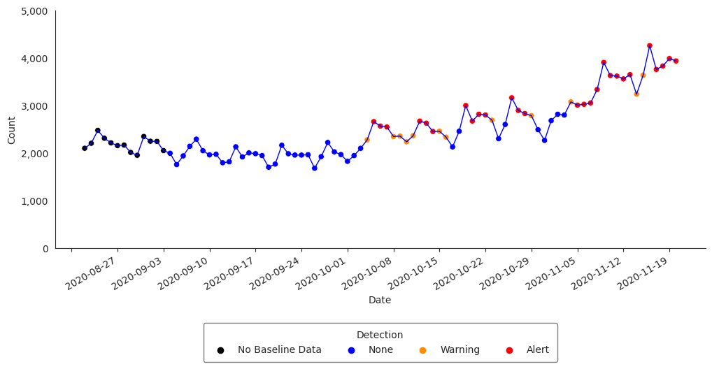
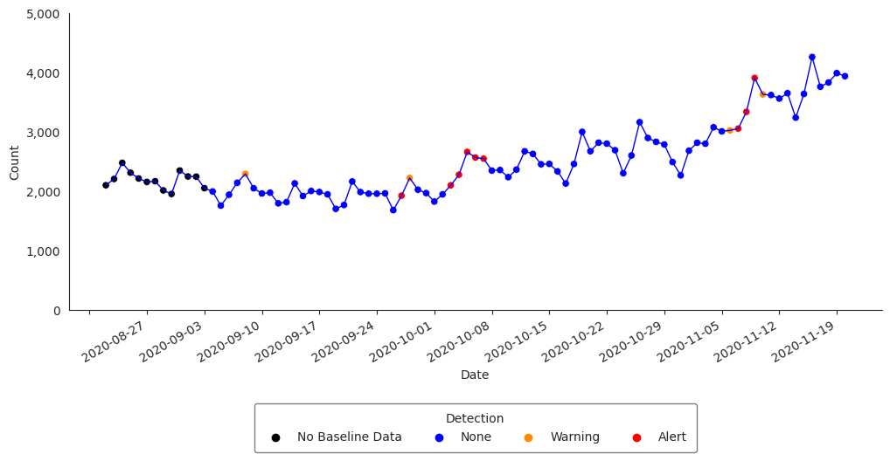
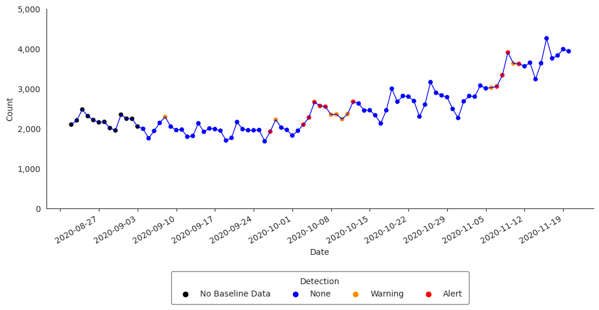
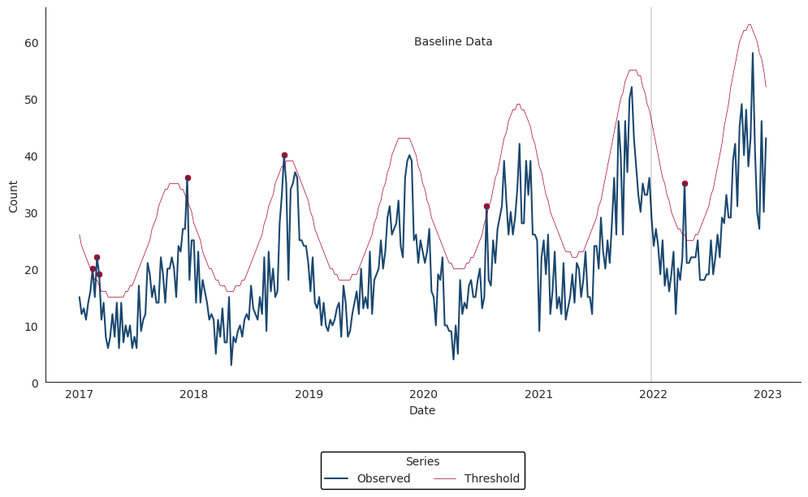
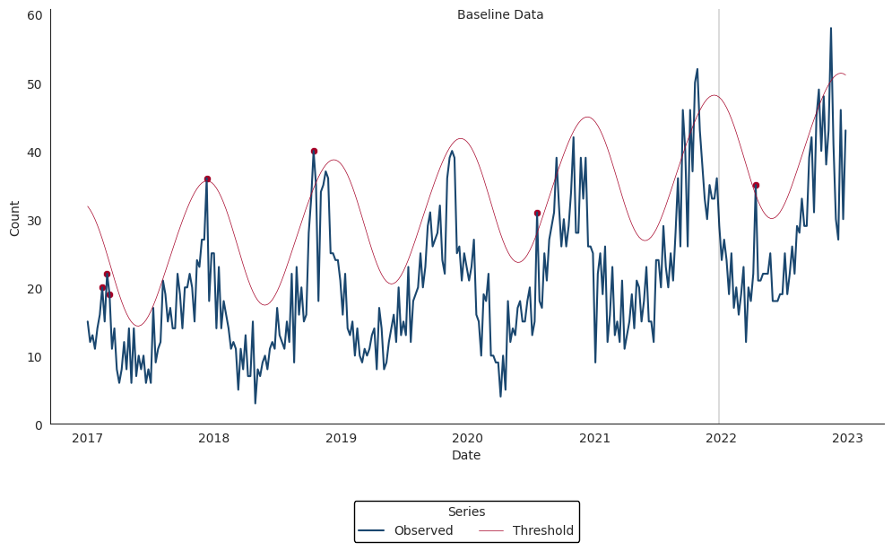

# Anomaly Detection

## Introduction
In this tutorial, we describe how to perform anomaly detection and trend classification analysis using time series data from NSSP-ESSENCE. This vignette uses time series data from NSSP-ESSENCE data source for the CLI CC with CLI DD and Coronavirus DD v2 definition, limiting to ED visits (Has been Emergency = “Yes”).

We start this tutorial by loading the `pynssp` package and related dependencies.

```python
>>> import pynssp
>>> import pandas as pd
```

We load additional packages for visualization purposes:

```python
import seaborn as sns
import matplotlib.pyplot as plt
import matplotlib.dates as mdates
```

Next, we create an NSSP user profile by creating an object of the class Credentials.

```python
>>> myProfile = pynssp.create_profile() # Creating an ESSENCE user profile

# save profile object to file for future use
>>> myProfile.pickle()
```

## Data Pull from NSSP-ESSENCE
With the NSSP `myProfile` object, we authenticate to NSSP-ESSENCE and pull in the data using the Time series data table API.

```python
>>> url = "https://essence2.syndromicsurveillance.org/nssp_essence/api/timeSeries?endDate=20Nov20&ccddCategory=cli%20cc%20with%20cli%20dd%20and%20coronavirus%20dd%20v2&percentParam=ccddCategory&geographySystem=hospitaldhhsregion&datasource=va_hospdreg&detector=probrepswitch&startDate=22Aug20&timeResolution=daily&hasBeenE=1&medicalGroupingSystem=essencesyndromes&userId=2362&aqtTarget=TimeSeries&stratVal=&multiStratVal=geography&graphOnly=true&numSeries=0&graphOptions=multipleSmall&seriesPerYear=false&nonZeroComposite=false&removeZeroSeries=true&startMonth=January&stratVal=&multiStratVal=geography&graphOnly=true&numSeries=0&graphOptions=multipleSmall&seriesPerYear=false&startMonth=January&nonZeroComposite=false"

# Data Pull from NSSP-ESSENCE
>>> api_data = pynssp.get_essence_data(url, profile = myProfile)

# Inspect pulled data frame
>>> api_data.info()
```

Before applying an anomaly detection function, let’s first group the data by HHS regions:

```python
>>> df_hhs = api_data.groupby("hospitaldhhsregion_display")
```

## Applying Detectors

### Exponentially Weighted Moving Average (EWMA)

The Exponentially Weighted Moving Average (EWMA) compares a weighted average of the most recent visit counts to a baseline expectation. For the weighted average to be tested, an exponential weighting gives the most influence to the most recent observations. This algorithm is appropriate for daily counts that do not have the characteristic features modeled in the regression algorithm. It is more applicable for Emergency Department data from certain hospital groups and for time series with small counts (daily average below 10) because of the limited case definition or chosen geographic region. The EWMA detection algorithm can be performed with `alert_ewma()` function (run `help(pynssp.alert_ewma)` in your Python console or `pynssp.alert_ewma?` in Jupyter Notebook or JupyterLab for more).

```python
>>> df_ewma = pynssp.alert_ewma(df_hhs, t = "date", y = "dataCount")
```

Let's subset the dataframe to visualize the time series with the anomalies for Region 4:

```python
>>> df_ewma_region = df_ewma[df_ewma["hospitaldhhsregion_display"] == "Region 4"]
```

Now, let’s visualize the time series with the anomalies

```python
>>> sns.set_style('whitegrid') # Set plot grid
>>> sns.set_style("white", {"axes.grid": False})

# Set plot size and y-axis limit
>>> plt.figure(figsize=(12, 6))
>>> plt.gca().set_ylim([0, 5000])

# Plot data
>>> sns.lineplot(data=df_ewma_region, x='date', y='dataCount', color='blue', linewidth=1)

>>> sns.scatterplot(
...     data=df_ewma_region, x='date', y='dataCount', hue='alert', 
...     palette=['black', 'blue', 'darkorange', 'red'], alpha=1
... )

# Format dates
>>> plt.gca().yaxis.set_major_formatter(plt.FuncFormatter(lambda x, loc: "{:,}".format(int(x))))
>>> plt.gca().xaxis.set_major_locator(mdates.WeekdayLocator())
>>> plt.gcf().autofmt_xdate()

# Set x and y axes labels
>>> plt.gca().set_xlabel('Date')
>>> plt.gca().set_ylabel('Count')

# Customize legend
>>> legend = plt.legend(
...     title='Detection', loc='lower center', bbox_to_anchor=(0.5, -0.5), 
...     ncol=5, frameon=True, framealpha=0.5, edgecolor='black', borderpad=0.75
... )

>>> legend.get_texts()[0].set_text('No Baseline Data')
>>> legend.get_texts()[1].set_text('None')
>>> legend.get_texts()[2].set_text('Warning')
>>> legend.get_texts()[3].set_text('Alert')

# Remove the top and right spines from plot
>>> sns.despine()
```



### Adaptive Multiple Regression

The Adaptive Multiple Regression algorithm fits a linear model to a baseline of counts or percentages, and forecasts a predicted value for test dates following a pre-defined buffer period following the baseline. This model includes terms to account for linear trends and day-of-week effects. This implementation does NOT include holiday terms as in the Regression 1.4 algorithm in ESSENCE. The EWMA detection algorithm can be performed with the `alert_regression()` function (run `help(pynssp.alert_regression)` in your Python console or `pynssp.alert_regression?` in Jupyter Notebook or JupyterLab for more).

```python
>>> df_regression = pynssp.alert_regression(df_hhs, t = "date", y = "dataCount")
```

Let’s filter `df_regression` and visualize the time series with the anomalies for Region 4:

```python
>>> df_regression_region = df_regression[df_regression["hospitaldhhsregion_display"] == "Region 4"]
```

```python
>>> sns.set_style('whitegrid') # Set plot grid
>>> sns.set_style("white", {"axes.grid": False})

# Set plot size and y-axis limit
>>> plt.figure(figsize=(12, 6))
>>> plt.gca().set_ylim([0, 5000])

# Plot data
>>> sns.lineplot(data=df_regression_region, x='date', y='dataCount', color='blue', linewidth=1)

>>> sns.scatterplot(
...     data=df_regression_region, x='date', y='dataCount', hue='alert', 
...     palette=['black', 'blue', 'darkorange', 'red'], alpha=1
... )

# Format dates
>>> plt.gca().yaxis.set_major_formatter(plt.FuncFormatter(lambda x, loc: "{:,}".format(int(x))))
>>> plt.gca().xaxis.set_major_locator(mdates.WeekdayLocator())
>>> plt.gcf().autofmt_xdate()

# Set x and y axes labels
>>> plt.gca().set_xlabel('Date')
>>> plt.gca().set_ylabel('Count')

# Customize legend
>>> legend = plt.legend(
...     title='Detection', loc='lower center', bbox_to_anchor=(0.5, -0.5), 
...     ncol=5, frameon=True, framealpha=0.5, edgecolor='black', borderpad=0.75
... )

>>> legend.get_texts()[0].set_text('No Baseline Data')
>>> legend.get_texts()[1].set_text('None')
>>> legend.get_texts()[2].set_text('Warning')
>>> legend.get_texts()[3].set_text('Alert')

# Remove the top and right spines from plot
>>> sns.despine()
```



### Regression/EWMA Switch

The NSSP-ESSENCE Regression/EWMA Switch algorithm generalized the Regression and EWMA algorithms by applying the most appropriate algorithm for the data in the baseline. First, adaptive multiple regression is applied where the adjusted R-squared value of the model is examined to see if it meets a threshold of >=0.60
. If this threshold is not met, then the model is considered to not explain the data well. In this case, the algorithm switches to the EWMA algorithm, which is more appropriate for sparser time series that are common with granular geographic levels.

The Regression/EWMA algorithm can be performed with the `alert_switch()` function (run `help(pynssp.alert_switch)` in your Python console or `pynssp.alert_switch?` in Jupyter Notebook or JupyterLab for more).

```python
>>> df_switch = pynssp.alert_switch(df_hhs, t = "date", y = "dataCount")
```

Let’s visualize the time series with the anomalies for Region 4:

```python
>>> df_switch_region = df_switch[df_switch["hospitaldhhsregion_display"] == "Region 4"]
```

```python
>>> sns.set_style('whitegrid') # Set plot grid
>>> sns.set_style("white", {"axes.grid": False})

# Set plot size and y-axis limit
>>> plt.figure(figsize=(12, 6))
>>> plt.gca().set_ylim([0, 5000])

# Plot data
>>> sns.lineplot(data=df_switch_region, x='date', y='dataCount', color='blue', linewidth=1)

>>> sns.scatterplot(
...     data=df_switch_region, x='date', y='dataCount', hue='alert', 
...     palette=['black', 'blue', 'darkorange', 'red'], alpha=1
... )

# Format dates
>>> plt.gca().yaxis.set_major_formatter(plt.FuncFormatter(lambda x, loc: "{:,}".format(int(x))))
>>> plt.gca().xaxis.set_major_locator(mdates.WeekdayLocator())
>>> plt.gcf().autofmt_xdate()

# Set x and y axes labels
>>> plt.gca().set_xlabel('Date')
>>> plt.gca().set_ylabel('Count')

# Customize legend
>>> legend = plt.legend(
...     title='Detection', loc='lower center', bbox_to_anchor=(0.5, -0.5), 
...     ncol=5, frameon=True, framealpha=0.5, edgecolor='black', borderpad=0.75
... )

>>> legend.get_texts()[0].set_text('No Baseline Data')
>>> legend.get_texts()[1].set_text('None')
>>> legend.get_texts()[2].set_text('Warning')
>>> legend.get_texts()[3].set_text('Alert')

# Remove the top and right spines from plot
>>> sns.despine()
```



### Negative Binomial Regression

The Negative Binomial Regression algorithm is intended for weekly time series spanning multiple years and fits a negative binomial regression model with a time term and cyclic sine and cosine terms to a baseline period that spans 2 or more years.
Inclusion of cyclic terms in the model is intended to account for seasonality common in multi-year weekly time series of counts for syndromes and diseases such as influenza, RSV, and norovirus.
Each baseline model is used to make weekly forecasts for all weeks following the baseline period. One-sided upper 95% prediction interval bounds are computed for each week in the prediction period. Alarms are signaled for any week during which the observed weekly count exceeds the upper bound of the prediction interval.
The Negative Binomial Regression detector can be applied with the `alert_nbinom()` function (run `help(pynssp.alert_nbinom)` in your Python console or `pynssp.alert_nbinom?` in Jupyter Notebook or JupyterLab for more).
The example below applies the Negative Binomial Regression detector to our synthetic time series for Scenario #1.

```python
>>> synth_ts1 = pynssp.get_scenario1() # Load synthesized time series data for scenario1
>>> synth_ts1.head()
```

Now, applying Negative Binomial detector...

```python
>>> df_nbinom = pynssp.alert_nbinom(synth_ts1, t='date', y='cases', baseline_end='2021-12-26')
```

```python
>>> fig, ax = plt.subplots(figsize=(12, 6))

>>> sns.lineplot(data=df_nbinom, x='date', y='cases', color='#1A476F', label='Observed', ax=ax)

>>> sns.lineplot(
...     data=df_nbinom, x='date', y='threshold', 
...     color='#A50026', linewidth=0.5, label='Threshold', ax=ax
... )

>>> sns.scatterplot(
...     data=df_nbinom.loc[df_nbinom['alarm']], 
...     x='date', y='cases', color='#A50026', ax=ax
... )

# Add vertical line
>>> ax.axvline(x=pd.to_datetime('2021-12-26'), color='black', linewidth=0.2)

# Add text annotation
>>> ax.text(pd.to_datetime('2019-12-01'), 60, 'Baseline Data', ha='left', va='center')

# Set axis labels and limits
>>> ax.set_xlabel('Date')
>>> ax.set_ylabel('Count')
>>> ax.set_ylim(bottom=0)
>>> ax.yaxis.set_major_formatter(plt.FuncFormatter(lambda x, loc: "{:,}".format(int(x))))

# Set legend
>>> ax.legend(
...     title="Series", loc='lower center', bbox_to_anchor=(0.5, -0.3), 
...     ncol=2, framealpha=1, edgecolor='black'
... )

# Set date axis
>>> ax.xaxis.set_major_locator(mdates.YearLocator())
>>> ax.xaxis.set_major_formatter(mdates.DateFormatter('%Y'))

# Set tick parameters
>>> ax.tick_params(axis='both', length=2.5, width=0.5)

# Set theme
>>> sns.set_style('white')
>>> sns.despine()
```



### Original Serfling detector

The Original Serfling detector is intended for weekly time series spanning multiple years.
It fits a linear regression model with a time term and sine and cosine terms to a baseline period that ideally spans 5 or more years.
Inclusion of Fourier terms in the model is intended to account for seasonality common in multi-year weekly time series. This implementation follows the approach of the original Serfling method in which weeks between October of the starting year of a season and May of the ending year of a season are considered to be in the epidemic period. Weeks in the epidemic period are removed from the baseline prior to fitting the regression model.
Each baseline model is used to make weekly forecasts for all weeks following the baseline period. One-sided upper 95% prediction interval bounds are computed for each week in the prediction period. Alarms are signaled for any week during which the observed weekly count exceeds the upper bound of the prediction interval.
The Original Serfling detector can be applied with the `alert_serfling()` function (run `help(pynssp.alert_serfling)` in your Python console or `pynssp.alert_serfling?` in Jupyter Notebook or JupyterLab for more).
Using the same simulated time series from the previous examples, the Negative Binomial Regression detector can be applied as below:

```python
# Apply Original Serfling detector
>>> df_serfling  = pynssp.alert_serfling(synth_ts1, t='date', y='cases', baseline_end='2021-12-26')
```

```python
>>> fig, ax = plt.subplots(figsize=(12, 6))

>>> sns.lineplot(data=df_serfling, x='date', y='cases', color='#1A476F', label='Observed', ax=ax)

>>> sns.lineplot(
...     data=df_serfling, x='date', y='threshold', 
...     color='#A50026', linewidth=0.5, label='Threshold', ax=ax
... )

>>> sns.scatterplot(
...     data=df_serfling.loc[df_serfling['alarm']], 
...     x='date', y='cases', color='#A50026', ax=ax
... )

# Add vertical line
>>> ax.axvline(x=pd.to_datetime('2021-12-26'), color='black', linewidth=0.2)

# Add text annotation
>>> ax.text(pd.to_datetime('2019-12-01'), 60, 'Baseline Data', ha='left', va='center')

# Set axis labels and limits
>>> ax.set_xlabel('Date')
>>> ax.set_ylabel('Count')
>>> ax.set_ylim(bottom=0)
>>> ax.yaxis.set_major_formatter(plt.FuncFormatter(lambda x, loc: "{:,}".format(int(x))))

# Set legend
>>> ax.legend(
...     title="Series", loc='lower center', bbox_to_anchor=(0.5, -0.3), 
...     ncol=2, framealpha=1, edgecolor='black'
... )

# Set date axis
>>> ax.xaxis.set_major_locator(mdates.YearLocator())
>>> ax.xaxis.set_major_formatter(mdates.DateFormatter('%Y'))

# Set tick parameters
>>> ax.tick_params(axis='both', length=2.5, width=0.5)

# Set theme
>>> sns.set_style('white')
>>> sns.despine()
```

